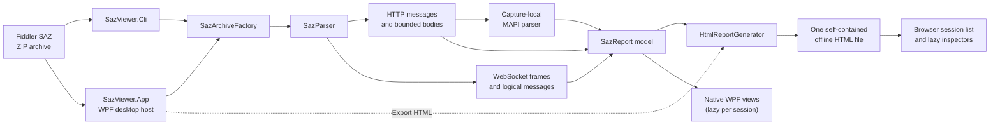
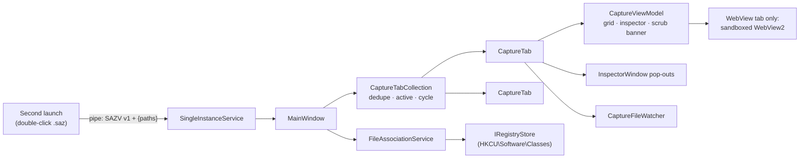

# Architecture guide

This guide explains SAZ Viewer from the outside in. Start here, then follow the links for the subsystem you need to change.

The CLI writes the report to disk for any browser. The desktop app runs the same parse (and optional scrub) pipeline, then shows the `SazReport` model in native WPF views that port the report's behavior. It generates the HTML only for an explicit Export, so exports stay byte-identical to the CLI. See [Desktop app: native views](desktop-app.md).

The desktop app is a tabbed host: `MainWindow` owns a `CaptureTabCollection` of `CaptureTab` objects. Each tab owns one capture's in-memory `ReportDocument`, its `CaptureViewModel` (grid and inspector), any pop-out inspector windows and a file watcher. Three small services sit beside the window: `SingleInstanceService` forwards second launches, `FileAssociationService` registers `.saz` per user, and `CaptureFileWatcher` detects file changes.

## Documents

| Document | Read it when you need to |
|---|---|
| [End-to-end data flow](data-flow.md) | Follow an archive entry from disk through parsing to the report |
| [MAPI parsing](mapi-parsing.md) | Understand envelopes, ROP dispatch, capture-local state, FastTransfer, and safety budgets |
| [Desktop app: native views](desktop-app.md) | Change a native view or view-model, the lazy loading path, shell features, or the WebView sandbox |
| [Report runtime](report-runtime.md) | Change the generated HTML, payload envelopes, inspectors, split view, search, or copy behavior |
| [Security model](security.md) | Review archive, password, captured-content, CSP, WebView, and Auth trust boundaries |
| [Testing and extension guide](testing-and-extension.md) | Find the right tests or add a parser, ROP, inspector view, or report field |

## Project and file map

| Path / principal type | Responsibility |
|---|---|
| `SazViewer.Cli\Program.cs` | Minimal process entry point that delegates to `CliApplication`. |
| `SazViewer.Cli\CliApplication.cs` | CLI parsing, help/errors/exit codes, secure interactive or redirected password input, parsing, and report writing. |
| `SazViewer.App\App.xaml.cs` / `AppArguments.cs` | Desktop entry point, `[--] [capture.saz ...]` / `--help` parsing, and the single-instance start-up decision (primary, forwarded, or standalone). |
| `SazViewer.App\MainWindow.xaml.cs` | Tab strip host: File menu (Open, Open Recent, Close tab, View scrubbed, Export, Export scrubbed), Tools menu (register/unregister), drag-and-drop, keyboard shortcuts, serialized background parse/reload/export with busy state, and title/status. |
| `SazViewer.App\CaptureTab.cs` / `CaptureTabView.xaml` | One open capture: tab header, in-memory `ReportDocument`, its `CaptureViewModel`, pop-out inspector windows, file watcher, and the inline changed/deleted/reload-failed notice. `Dispose` releases all of them. |
| `SazViewer.App\CaptureTabCollection.cs` | UI-free ordered tab list: path de-duplication, active tab, cycling, and the next tab to activate on close. |
| `SazViewer.App\SingleInstanceService.cs` / `SingleInstanceProtocol.cs` | Per-user `Local\` mutex plus a current-user-ACL named pipe, and the versioned length-prefixed request format. |
| `SazViewer.App\ForwardedPathValidator.cs` | Resolves arguments to full paths and accepts only existing, normalized, fully qualified `.saz` paths up to 2,048 characters. |
| `SazViewer.App\FileAssociationService.cs` / `RegistryStore.cs` | Per-user `.saz` Open-with registration through the `IRegistryStore` abstraction (HKCU implementation plus a test fake), stale-path detection, and `SHChangeNotify`. |
| `SazViewer.App\CaptureFileWatcher.cs` | `FileSystemWatcher` wrapper, `Debouncer` (`TimeProvider`-based), `FileFingerprint`, and `FileChangeTracker`, which decides whether to show a notice. |
| `SazViewer.App\ReportBuilder.cs` | CLI-equivalent parse → optional `AuthScrubber` pipeline, `ReportDocument` (model plus HTML generated on first Export), UTF-8 (no BOM) export, and failure wording. |
| `SazViewer.App\Model\*` | UI-free ports of the report's payload and helpers: `SessionRow`, `MessageContent`, `StructuredData`, `ImageSafety`, `WebPreviewPolicy`. |
| `SazViewer.App\ViewModels\*` / `Views\*` | One small view-model and view per native view; see the [view-model map](desktop-app.md#view-model-map). |
| `SazViewer.App\Themes\*` / `UiPreferences.cs` | Light/dark/high-contrast palettes, `ThemeManager`, and persisted theme, layout and banner preferences. |
| `SazViewer.App\WebPreviewSession.cs` / `WebViewEnvironment.cs` | Applies the WebView tab's sandbox policy to one WebView2; the shared per-user WebView2 environment. |
| `SazViewer.App\InspectorWindow.xaml.cs` | Pop-out window for **Open in new window**. |
| `SazViewer.App\PasswordDialog.xaml.cs` | Modal masked password dialog and the three-attempt `ISazPasswordProvider` adapter. |
| `SazViewer.App\RecentFilesStore.cs` / `AppPaths.cs` | Per-user `%LOCALAPPDATA%\SazViewer` paths and the bounded, path-only `recent.json` list. |
| `SazViewer.Core\Models.cs` | Public report, HTTP, retained-body, WebSocket message, and frame models. |
| `SazViewer.Core\SazArchive.cs` / `SazArchiveFactory` | ZIP inspection, plain/encrypted reader selection, archive limits, integrity checks, and bounded entry access. |
| `SazViewer.Core\SazPasswordProvider.cs` | Password-provider contract, password limit, and archive/password exception taxonomy. |
| `SazViewer.Core\SazParser.cs` / `SazParser` | Sparse `raw/<id>_*` discovery, per-session orchestration, metadata/timers, WebSocket association, MAPI handoff, and chronological ordering. |
| `SazViewer.Core\HttpMessageParser.cs` | HTTP start line, ordered headers, CRLF body boundary, charset-safe preview, and hex rendering. |
| `SazViewer.Core\HttpBodyDecoder.cs` | Transfer/content coding removal, decompression validation, retained-byte ownership, and decoding warnings. |
| `SazViewer.Core\BodyFormatter.cs` | Server-side JSON/XML/text format detection and bounded pretty formatting used by parity tests and fallbacks. |
| `SazViewer.Core\SafeHtmlPreview.cs` / `SafeHtmlPreviewBuilder` | Conservative HTML recognition and inert WebView document construction. |
| `SazViewer.Core\WebSocketParser.cs` | Fiddler `_w.txt` record parsing and bounded RFC 6455 frame extraction. |
| `SazViewer.Core\WebSocketMessageAssembler.cs` | Fragment/control-frame handling and frame-to-logical-message reassembly. |
| `SazViewer.Core\HtmlReportGenerator.cs` | Static HTML/CSS/JavaScript shell, CSP, browser-side list, inspector, tabs, search, copy, theme, popup, and split-view behavior. |
| `SazViewer.Core\HtmlReportGenerator.Payloads.cs` | Session-list markup plus versioned compressed HTTP, MAPI, and WebSocket payload construction. |
| `SazViewer.Tests` | Unit, integration, generator/envelope, encryption, CLI, and real Edge coverage. |
| `SazViewer.App.Tests` | Desktop argument parsing and forwarding validation, the single-instance protocol and real-pipe service, registry layout through a fake and a sandboxed HKCU key, watcher debounce, change tracking and real file events, tab de-duplication and lifecycle, recent-files storage, byte-for-byte CLI export parity, native view-model logic (grid, filters, trees, search, Auth, image, hex, MAPI, WebSocket, layout, theme, scrub banner), the WebView sandbox policy, and launched-app UI Automation smoke tests (including second-launch forwarding into a new tab). |
| `docs\mapi-parity.json` | Machine-readable MAPI protocol coverage inventory. |

### MAPI files

| Path / principal type | Responsibility |
|---|---|
| `Mapi\MapiModels.cs` | Public MAPI tree/report models, `MapiCaptureContext` transactional state, and shared parse limits. |
| `Mapi\MapiCaptureParser.cs` | Detects MAPI/HTTP sessions, owns capture-local state, and correlates request/response parsing. |
| `Mapi\MapiHttpMessageParser.cs` | Parses MAPI/HTTP request types and response envelopes before protocol dispatch. |
| `Mapi\MapiReader.cs` | Offset-aware bounded primitive reader, parse exception, and shared `MapiNodeBudget`. |
| `Mapi\AuxiliaryPayloadParser.cs` | Parses MAPI auxiliary blocks and performance/session metadata. |
| `Mapi\ExtendedBufferParser.cs` | Validates and unwraps compressed/XOR extended buffers before ROP parsing. |
| `Mapi\RopBufferParser.cs` | Splits ROP buffers, validates handle tables, and coordinates semantic operation parsing. |
| `Mapi\RopSemanticParser.cs` | Central fixed-schema ROP catalog and operation dispatcher. |
| `Mapi\RopVariableDispatcher.cs` | Routes variable-shape ROPs to family-specific decoders. |
| `Mapi\RopFolderTableDecoders.cs` | Folder, hierarchy, contents-table, row, and related table operations. |
| `Mapi\RopMessageRulesDecoders.cs` | Message, attachment, recipient, stream, rules, synchronization, and import operations. |
| `Mapi\RopPropertyStoreDecoders.cs` | Property, named-property, notification, and store/logon operations. |
| `Mapi\RopFastTransferDecoders.cs` | FastTransfer/ICS ROP semantics and capture-local stream/state transitions. |
| `Mapi\FastTransferStreamLexer.cs` | Incremental MS-OXCFXICS token/value decoding with split-value continuation. |
| `Mapi\FastTransferGrammar.cs` | Validates root-specific FastTransfer production order and completion. |
| `Mapi\FastTransferStreamState.cs` | Immutable lexer/grammar state, hard limits, and capture-local multi-buffer assembler. |
| `Mapi\NspiPropertyParser.cs` | NSPI property rows/values with wire-width context. |
| `Mapi\NspiRestrictionParser.cs` | Bounded recursive NSPI restriction parsing. |
| `Mapi\MapiEntryIdParser.cs` | Store, folder, message, address-book, and one-off EntryID structures. |
| `Mapi\MapiServerIdParser.cs` | ServerId and folder/message identifier variants. |
| `Mapi\RuleActionParser.cs` | Rule action blocks, action-specific payloads, and embedded restrictions. |
| `Mapi\MapiPropertyNames.Generated.cs` | Generated property-tag-to-symbol lookup used for readable trees. |

## Core data model

`SazReport` is the handoff between parsing and rendering. It owns chronological `HttpSession` objects, logical `WebSocketMessage` objects, aggregate warnings, and the optional `MapiCapture`. An `HttpMessage` preserves ordered headers and a `BodyPreview`. The body model distinguishes:

- captured bytes before transfer/content decoding;
- decoded bytes used by ordinary inspectors;
- fully normalized bytes retained only for bounded MAPI candidates;
- original and decoded lengths, truncation, charset, and removed encodings.

MAPI output is a bounded immutable `MapiNode` tree. Browser code never reparses MAPI wire bytes.

## Design invariants

1. **One bad entry does not discard the archive.** Session-local failures become warnings whenever safe continuation is possible.
2. **Bytes are bounded before interpretation.** Archive, HTTP, WebSocket, report, tree, and search layers each enforce their own limits.
3. **State is capture-local and transactional.** MAPI correlation is committed only after the protocol response establishes success.
4. **Captured content is data, never application code.** The outer report uses text nodes/encoding and the desktop app uses native text controls; WebView is a separate deny-all sandbox in both.
5. **The report is portable and offline.** CSS, JavaScript, models, and compressed payloads are embedded; no network dependency exists.
6. **Expensive views are lazy.** The list metadata is immediately available, while per-session envelopes (report) or view-models (desktop), trees, images, and frames hydrate only when selected.
