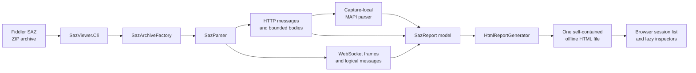

# Architecture guide

This guide explains SAZ Viewer from the outside in. Start here, then follow the links for the subsystem you need to change.

## Documents

| Document | Read it when you need to |
|---|---|
| [End-to-end data flow](data-flow.md) | Follow an archive entry from disk through parsing to the report |
| [MAPI parsing](mapi-parsing.md) | Understand envelopes, ROP dispatch, capture-local state, FastTransfer, and safety budgets |
| [Report runtime](report-runtime.md) | Change the generated HTML, payload envelopes, inspectors, split view, search, or copy behavior |
| [Security model](security.md) | Review archive, password, captured-content, CSP, WebView, and Auth trust boundaries |
| [Testing and extension guide](testing-and-extension.md) | Find the right tests or add a parser, ROP, inspector view, or report field |

## Repository map

| Path | Responsibility |
|---|---|
| `SazViewer.Cli` | Argument handling, secure password input, exit codes, and writing the report |
| `SazViewer.Core\SazArchive.cs` | ZIP inspection, encryption selection, archive limits, authenticated entry reads |
| `SazViewer.Core\SazParser.cs` | Sparse `raw/<id>_*` discovery, per-session orchestration, metadata, ordering |
| `SazViewer.Core\HttpMessageParser.cs` | HTTP start line, headers, body boundary, charset-safe preview |
| `SazViewer.Core\HttpBodyDecoder.cs` | Chunked transfer removal, content decoding, byte retention, safety limits |
| `SazViewer.Core\WebSocket*.cs` | Fiddler `_w.txt` records, RFC 6455 frames, fragmentation and logical messages |
| `SazViewer.Core\Mapi` | MAPI/HTTP, NSPI, ROP, property, FastTransfer, and capture-state parsing |
| `SazViewer.Core\HtmlReportGenerator.cs` | Static HTML/CSS/JavaScript shell and browser-side behavior |
| `SazViewer.Core\HtmlReportGenerator.Payloads.cs` | Server-side list markup, canonical HTTP envelopes, MAPI/WS payloads |
| `SazViewer.Tests` | Unit, integration, generated-report, encryption, and real Edge coverage |
| `docs\mapi-parity.json` | Machine-readable MAPI coverage inventory |

## Core data model

`SazReport` is the handoff between parsing and rendering. It owns chronological `HttpSession` objects, logical `WebSocketMessage` objects, aggregate warnings, and the optional `MapiCapture`. An `HttpMessage` preserves ordered headers and a `BodyPreview`. The body model distinguishes:

- captured bytes before transfer/content decoding;
- decoded bytes used by ordinary inspectors;
- fully normalized bytes retained only for bounded MAPI candidates;
- original and decoded lengths, truncation, charset, and removed encodings.

MAPI output is a bounded immutable `MapiNode` tree. Browser code never reparses MAPI wire bytes.

## Design invariants

1. **One bad entry does not discard the archive.** Session-local failures become warnings whenever safe continuation is possible.
2. **Bytes are bounded before interpretation.** Archive, HTTP, WebSocket, report, tree, and search layers each enforce their own limits.
3. **State is capture-local and transactional.** MAPI correlation is committed only after the protocol response establishes success.
4. **Captured content is data, never application code.** The outer report uses text nodes/encoding; WebView is a separate deny-all sandbox.
5. **The report is portable and offline.** CSS, JavaScript, models, and compressed payloads are embedded; no network dependency exists.
6. **Expensive views are lazy.** The list metadata is immediately available, while per-session envelopes, trees, images, and frames hydrate only when selected.

