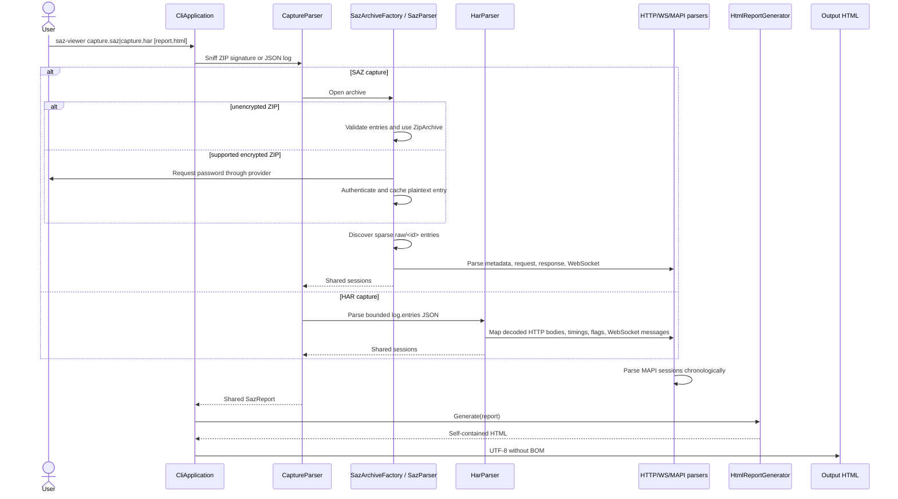
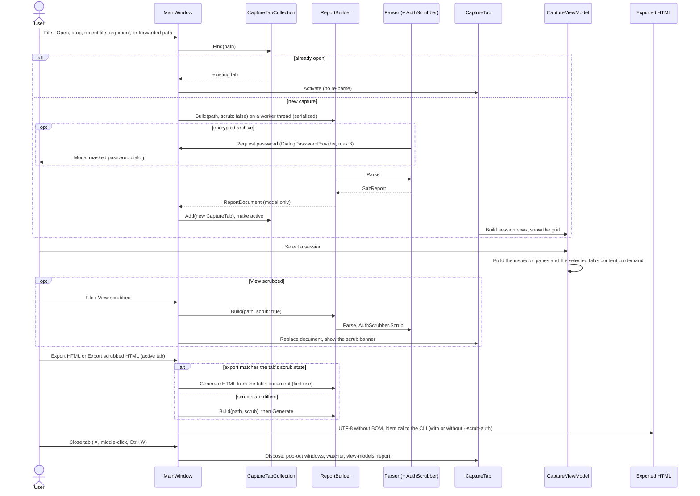
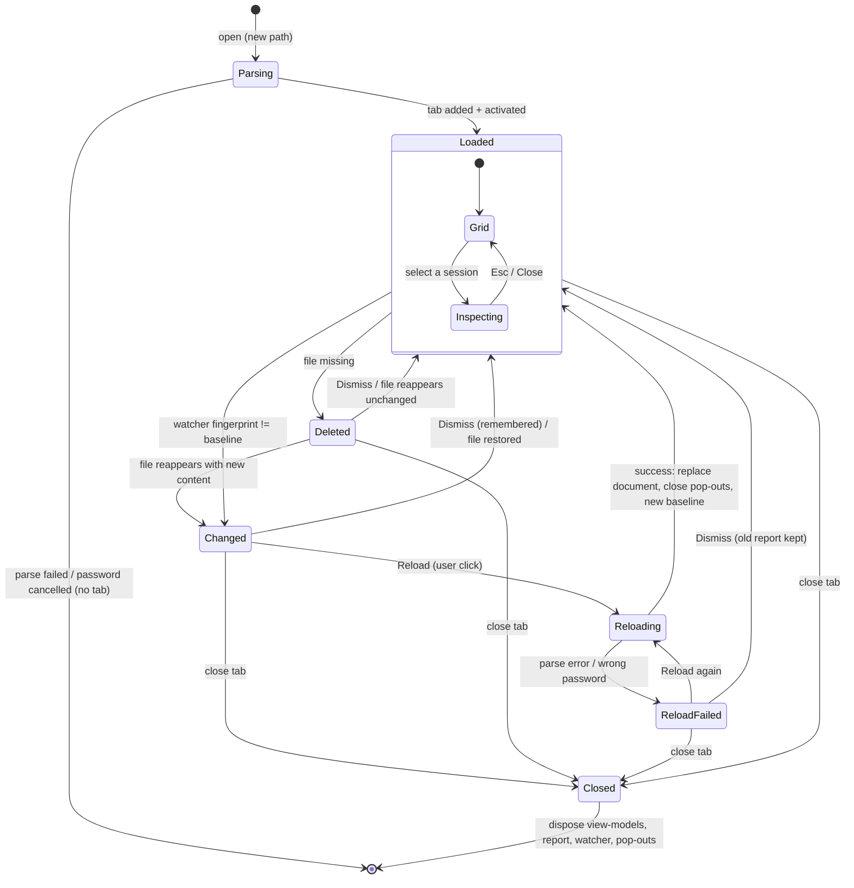
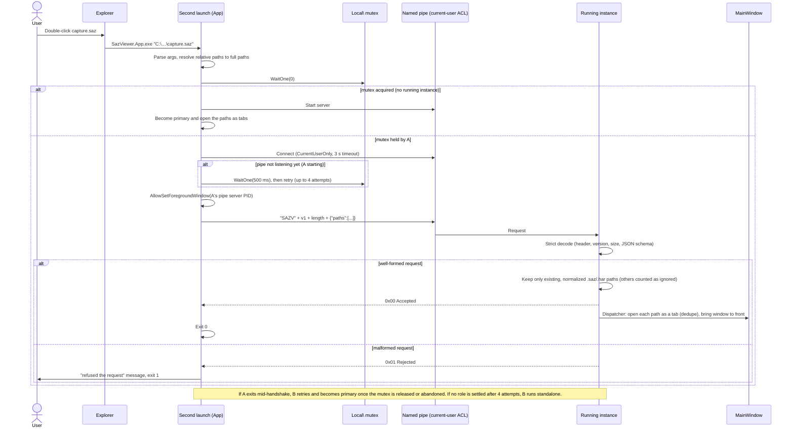
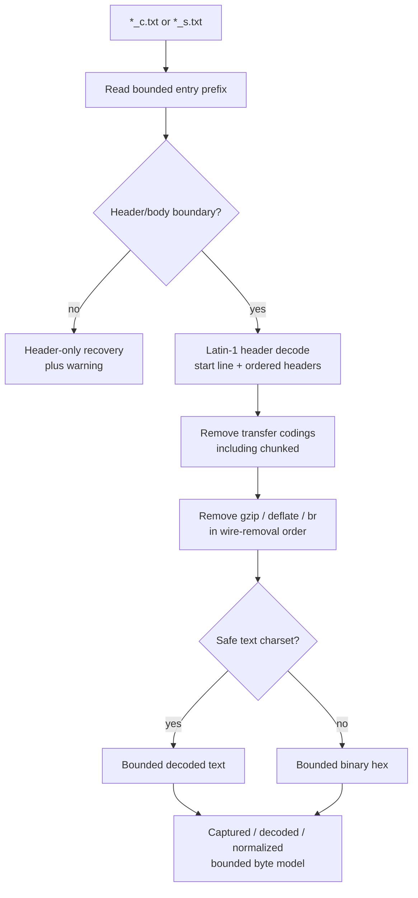

# End-to-end data flow

## CLI to report

## Desktop app

The desktop app reuses the same parse (and optional scrub) pipeline but renders the `SazReport` model in native WPF views. Per-session work happens only when a session is selected; see [lazy loading](desktop-app.md#lazy-loading). The report HTML is generated only on Export.

### Tab lifecycle, file changes, and reload

The tab records a `FileFingerprint` (length plus last-write time) just before each parse. `CaptureFileWatcher` watches the containing directory for the file name, including renames into or out of that name, so temp-file-then-rename saves are detected. It coalesces bursts with a 400 ms `Debouncer` and then raises one event, which the tab handles on the UI thread. `FileChangeTracker` compares the current fingerprint with the baseline. The app's own reads do not change the fingerprint, so they never raise a notice, and a dismissed state is not reported again.

### Single-instance hand-off

The forwarding client finds the server process with `GetNamedPipeServerProcessId` and calls `AllowSetForegroundWindow` for it. This lets the running window come to the front even though the second launch owns the foreground. No password, option, or working directory is ever sent.

## Archive discovery

`SazParser` recognizes these independent entries without assuming contiguous IDs:

| Entry | Meaning |
|---|---|
| `raw/<id>_c.txt` | Captured client request |
| `raw/<id>_s.txt` | Captured server response |
| `raw/<id>_m.xml` | Fiddler metadata and timers |
| `raw/<id>_w.txt` | Fiddler WebSocket record stream |

Entries are grouped case-insensitively. The first duplicate wins and produces a warning. Each group remembers its first archive position for stable fallback ordering. HTTP sessions are sorted by the best parsed Fiddler timestamp, then by archive order or numeric ID fallback. WebSocket messages use timestamp and stable source order.

## HAR mapping

`HarParser` reads a bounded HTTP Archive 1.2 JSON document and maps each `log.entries` item to the same `HttpSession` model. `startedDateTime` provides chronological order; original entry index supplies stable IDs and fallback order. HAR `content.text` is already decoded, including base64 decoding when `content.encoding` is `base64`, so `Content-Encoding` is never applied again and original wire bytes remain explicitly unavailable. HAR timing values populate typed timer metadata (`wait` → TTFB, `receive` → download, plus DNS/connect/SSL), while creator/browser, page, initiator, resource type, priority, connection, and server address remain available through report metadata and desktop columns. Chrome/Edge `_webSocketMessages` map to the shared WebSocket model.

## HTTP path

Decoding is transactional: a malformed, unsupported, incomplete, or over-limit stage does not expose partial decoded data. It falls back to the retained captured-byte representation and adds a warning. MAPI candidates retain normalized bytes up to the protocol payload limit; ordinary display remains limited to 64 KiB.

## WebSocket path

`WebSocketParser` treats `_w.txt` as alternating pseudo-header blocks and declared-length binary records, not as a text transcript. It:

1. identifies request/server direction from `Request-Length` or `Response-Length`;
2. parses one RFC 6455 frame from the bounded record prefix;
3. preserves FIN, opcode, mask, timestamp, lengths, and warnings;
4. retains malformed records as undecoded frames when safe resynchronization is impossible;
5. passes frames to `WebSocketMessageAssembler`, which reassembles fragmented data separately by direction while retaining control frames.

## Rendering handoff

The generated report has two data layers:

- **inline list metadata** for immediate sorting/filtering/navigation;
- **independently compressed envelopes** for HTTP sessions, MAPI trees, and WebSocket sessions.

Every HTTP session stores one versioned canonical request/response envelope. Headers, Raw, JSON/XML, Auth, Image, WebView, HexView, search, and copy text are derived in the browser only when needed. This keeps report size and initial browser work proportional to the session list rather than every possible view.
