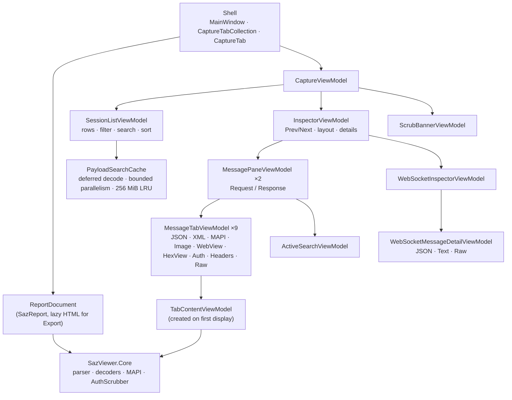
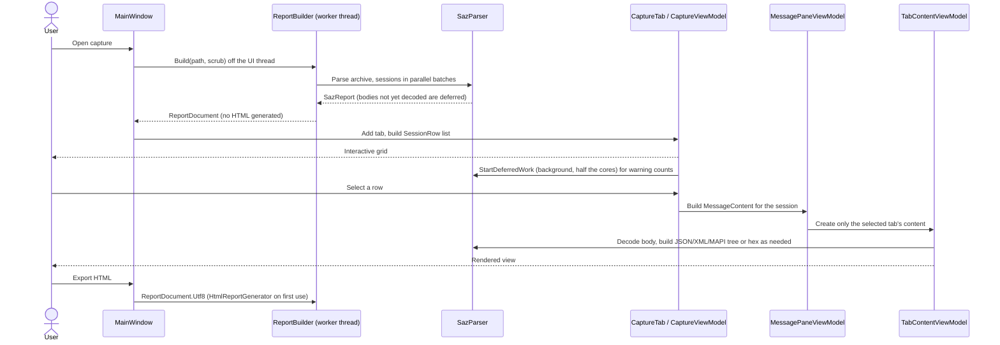

# Desktop app: native views

`SazViewer.App` is a WPF (`net8.0-windows`) application that shows each capture in native WPF views. The generated HTML report and its JavaScript are the functional specification. The app ports that behavior to small view-models; it does not host the report. The only HTML the app ever renders is the inert, sanitized document of the per-side **WebView** tab, inside a locked-down WebView2 sandbox (see [WebView sandbox](#webview-sandbox)). **Export HTML** still writes the CLI's report byte for byte.

## Layers

- **Model** (`SazViewer.App\Model`): UI-free ports of the report's payload construction and helpers. `SessionRow` mirrors the grid cells and filter data; `MessageContent` mirrors the per-message payload and its Headers/Raw text; `StructuredData` builds JSON/XML value trees and formatted text; `ImageSafety` validates and decodes images; `WebPreviewPolicy` is the WebView sandbox policy.
- **View-models** (`SazViewer.App\ViewModels`): one small class per view, built on `ObservableObject`/`RelayCommand` (`SazViewer.App\Mvvm`). They don't reference WPF controls, so the tests drive them directly.
- **Views** (`SazViewer.App\Views`): XAML with minimal code-behind for focus, keyboard and scrolling. Lists and trees are virtualized (`VirtualizingStackPanel` with recycling). Trees are flattened into rows (`LineDocumentView`, `ValueTreeView`), so expand/collapse changes a list instead of building a deep visual tree.
- **Themes** (`SazViewer.App\Themes`): `Light.xaml`, `Dark.xaml` and a code-built high-contrast palette with identical keys; every view uses `DynamicResource`. `Controls.xaml` restyles the standard controls, including shared slim, arrowless scrollbars with themed tracks, thumbs and corners. Transparent track buttons retain native paging, and the standard `ScrollViewer` content presenter preserves keyboard/wheel scrolling and virtualization.

## View-model map

| View-model | View | Report counterpart | Notes |
|---|---|---|---|
| `CaptureViewModel` | `CaptureView` | page | Root of one tab: grid, inspector, scrub banner, theme toggle. |
| `SessionListViewModel` | grid in `CaptureView` | session table, filter, search | Columns Time, ID, Result, Method, URL, Elapsed Time, Req, Resp; chronological order, sortable; filters All, WebSocket, MAPI/NSPI, 2xx–5xx, Missing/other; Hide CONNECT; optional asynchronous payload search. |
| `InspectorViewModel` | `InspectorView` (also in `InspectorWindow`) | inspector dialog | Previous/Next over the visible rows (`Alt+Left`/`Alt+Right`), position, Request/Response, split/single layout per width class, Open in new window, Esc. |
| `MessagePaneViewModel` | `MessagePaneView` | `createMessagePanel` | Fixed-order tabs, initial tab MAPI > JSON/XML > Raw > Headers, the pane's own active-view search. |
| `MessageTabViewModel` | tab strip | per-side tab | Enabled state, Copy toolbar, lazily creates its content. |
| `TextDocumentViewModel` | `LineDocumentView` | Headers, Raw | Decode status, captured-bytes toggle, search highlights. |
| `StructuredBodyViewModel` + `ValueTreeViewModel` | `StructuredBodyView`, `ValueTreeView` | `createStructuredBody` | Tree and syntax-highlighted Formatted Text; [Expand all][Collapse all][Copy] in Tree mode. |
| `MapiViewModel` | `ValueTreeView` | `renderProtocolTree` | Dense, expanded tree with kind and `@offset +length`; bounded hex for binary. |
| `ImageViewModel` | `ImageView` | `createImageView` | Signature validation (PNG/JPEG/GIF/WebP/BMP/ICO, never SVG), MIME mismatch warning, off-thread bounded decode, bitmap released on leave. |
| `WebPreviewViewModel` | `WebPreviewView` | `createWebView` | Rendered (sandboxed WebView2) and Source modes. |
| `HexViewModel` | `HexView` | `createHexView` | Offsets, 16-byte rows, ASCII gutter, Captured/Decoded toggle, truncation label. |
| `AuthViewModel` | `AuthView` | `createAuthView` | Redacted until Reveal; reveal resets on every transition; Copy returns full values only while revealed. |
| `ActiveSearchViewModel` | `ActiveSearchBar` | active-view search | Case-insensitive literal, Enter/Shift+Enter, 5,000-match cap, reveals and later restores collapsed ancestors. |
| `WebSocketInspectorViewModel` / `WebSocketMessageItem` | `WebSocketInspectorView` | `renderWebSocketInspector` | ID/Type/Body/Preview list, payload filter, resizable panes. |
| `WebSocketMessageDetailViewModel` | `MessagePaneView` | `renderWebSocketMessageDetail` | JSON/Text/Raw tabs, payload search, control frames, direction. |
| `ScrubBannerViewModel` | banner in `CaptureView` | scrub banner | Per-type counts; collapsed by default; state remembered. |

## Lazy loading

Opening a capture parses the archive and builds only what the grid needs. Everything per session is built on demand.

- The grid needs only start lines, headers, metadata timers and sizes. Body decoding that isn't needed for the grid is deferred (`SazReport.HasDeferredWork`), then completed in the background so the status bar can show the final warning count. A view that needs a body decodes it immediately regardless.
- **Search payloads** remains off by default. When enabled, `SessionListViewModel` waits 250 ms after a query change, cancels the prior generation, then asks `PayloadSearchCache` to extract/search sessions on at most eight worker threads. HTTP headers and decoded bodies (including chunked/compressed content), WebSocket text and valid UTF-8 binary payloads, and already-built MAPI node names/values are folded with the same literal case-insensitive semantics as column search. Search-only HTTP decoding can retain up to the decoder's existing 4 MiB safety ceiling temporarily without hydrating the 64 KiB display body. A per-capture 256 MiB LRU owns the folded text; each session is additionally capped at 32 Mi characters. Progress and cancellation are marshalled back to the UI, and filtering/sorting is applied after the payload result is published. Scrubbed reports contain eager scrubbed messages, so the search-only decoder can never reach their original captured bytes.
- Tab content is created the first time the tab is shown and dropped when the session changes. Expensive work (image decode, WebView2) runs only while its tab is visible.
- Core's existing caps and budgets are unchanged: the 64 KiB display body limit, the MAPI node/depth budgets, the JSON/XML tree budgets, the 1,024-byte HexView prefix and the 5,000-match search cap.
- The HTML is generated only for Export HTML, through the same `HtmlReportGenerator` call as the CLI (`SazParser.CompleteDeferred` runs first), so the exported bytes are identical.

### Startup

- **Prefetch.** When the app is launched with a capture path, `App` starts `CapturePrefetch` (the same `ReportBuilder.Build` on a worker thread) right after the single-instance check, before the main window is built. Window creation and the parse then overlap, and `MainWindow.OpenCaptureAsync` takes over the running parse and its pre-parse fingerprint for the first matching path. A password prompt for an encrypted capture is marshalled to the UI thread and owned by the main window once it is visible.
- **No WebView2 at startup.** The WebView2 environment is created only when a WebView tab is first shown.
- **Lean grid rows.** Session grid rows use a minimal template (no row header, details presenter or frozen-column grid), and column widths are fitted from a sample of rows, not all of them. Only the visible rows are realized.
- **ReadyToRun.** Publishing for a runtime identifier (`-r win-x64`) precompiles the app and Core (`PublishReadyToRun`), which removes most JIT time from the first parse and first render.
- **Measuring.** Set `SAZVIEWER_STARTUP_TRACE` to a fully qualified file path, and the app appends `milliseconds-since-process-start<TAB>phase` lines for `OnStartup`, `single-instance`, `parse-start`/`parse-end`, `window-created`, `window-shown`, `tab-added` and `grid-idle` (the first idle after the grid's first render). Tracing is off when the variable is unset.

## Shell features

- **Options.** The top-level **Options** menu exposes mutually exclusive, checkable choices with access keys. Changes are written immediately through `UiPreferences` and applied to every open capture where relevant.
- **Layout.** Automatic mode keeps the existing 900 px behavior: wide HTTP inspectors default to split Request/Response panes, narrow inspectors default to single, and each width class remembers its own toggle choice. **Always split** and **Always single** override those defaults. The in-inspector toggle remains usable; in Automatic mode it updates the current width-class preference, while an Always mode treats it as an inspector-lifetime temporary override. Changing the Options setting clears temporary overrides immediately. Narrow split views stack vertically. Split mode hides the Request/Response tabs and gives each pane a labeled header and its own search.
- **Theme.** System (the default), Light, and Dark are one `UiPreferences.Theme` source shared by the Options radio items and light-bulb button. System follows live Windows app-theme changes. Windows high contrast overrides every choice with a palette built from `SystemColors`; title bars follow the effective theme through `DwmSetWindowAttribute`.
- **Session viewer.** Bottom pane (default) places the grid above the existing `InspectorViewModel`; Right pane places the grid on its left. The outer `GridSplitter` changes orientation, enforces usable grid/inspector minimums, and persists independent bottom-height and right-width proportions (defaults: 40% grid height and 45% grid width). Right-pane HTTP split mode always stacks Request above Response with a resizable, remembered 50/50 split; WebSocket traffic similarly stacks its message list above the detail. Bottom pane and New window retain the normal width-responsive inspector layout. New window hides the embedded pane and hosts the same grid-following model in one non-owned `InspectorWindow` per capture tab. Selection updates reuse the window with `ShowActivated=false`, preserving grid focus; Previous/Next updates the grid selection. Closing the window closes the inspector, and the next selection recreates it. Runtime mode changes preserve and rehost an open inspector. The explicit **Open in new window** action still creates an additional independent inspector and view-model.
- **Hide CONNECT on open.** The preference seeds `SessionListViewModel.HideConnect` only when a capture view-model is constructed. Tab-local checkbox changes are intentionally not written back.
- **Open in new window.** `InspectorWindow` hosts a second `InspectorViewModel` that navigates the tab's visible rows independently of the grid selection. It closes with Close/Esc, when its tab closes, or when the capture is reloaded.
- **View scrubbed.** **File › View scrubbed (redact credentials)** reopens the active capture with `AuthScrubber` applied, the same pass as `--scrub-auth`. The views then show `[REDACTED:…]` markers, and the banner lists per-type counts.
- **Icon.** `Assets\SazViewer.ico` (generated by `Assets\Generate-Icon.ps1`) is the `ApplicationIcon`, so it is embedded in the exe and used for Explorer and the `.saz` association's `DefaultIcon` (`"<exe>",0`). It is also a WPF resource set as the `Icon` of `MainWindow` and `InspectorWindow`.
- **Preferences.** `UiPreferences` stores the theme, layout mode and per-width automatic choices, session-viewer location and splitter proportions, Hide CONNECT-on-open, payload-search choice, and banner state in `%LOCALAPPDATA%\SazViewer\preferences.json`, written atomically. Version 1 fields (`Theme`, `HttpLayoutWide`, `HttpLayoutNarrow`, and `ScrubBanner`) are retained while the document is upgraded to version 2. Missing, unknown, or corrupt values fall back independently to defaults.
- **Accessibility.** Every control is reachable by keyboard. Tab strips support arrow keys with a fixed order, and splitters are focusable and keyboard-resizable. Interactive elements carry UIA names. Focus returns to the grid row when the inspector closes.

## WebView sandbox

WebView2 is used only by the WebView tab, and only while that tab is visible in Rendered mode.

- **Content.** The document is the report's sanitized inert HTML (`SafeHtmlPreviewBuilder` in Core): captured attributes, scripts, styles, forms, metadata, SVG/MathML, frames and embedded resources are removed.
- **Lifetime.** `WebPreviewView` creates the WebView2 lazily and disposes it when the tab, side, session or mode changes, when the view unloads, or when the document tries to navigate.
- **Policy.** `WebPreviewPolicy` (unit-tested) and `WebPreviewSession` (applies it):
  - scripts, host objects, web messages, context menus, accelerators, autofill, password saving, swipe navigation, status bar, built-in error pages and SmartScreen are off; DevTools are on only in Debug builds;
  - the document is served once from memory at `https://webview-preview.sazviewer.invalid/document.html` (the `.invalid` TLD never resolves); every other request gets `403` before leaving the process, so no network request is made;
  - only the initial navigation is allowed; any later top-level navigation closes the preview, and frame navigation, new windows, downloads, permissions, authentication prompts and external schemes are refused.
- **Environment.** `WebViewEnvironment` shares one per-user environment under `%LOCALAPPDATA%\SazViewer\WebView2`.
