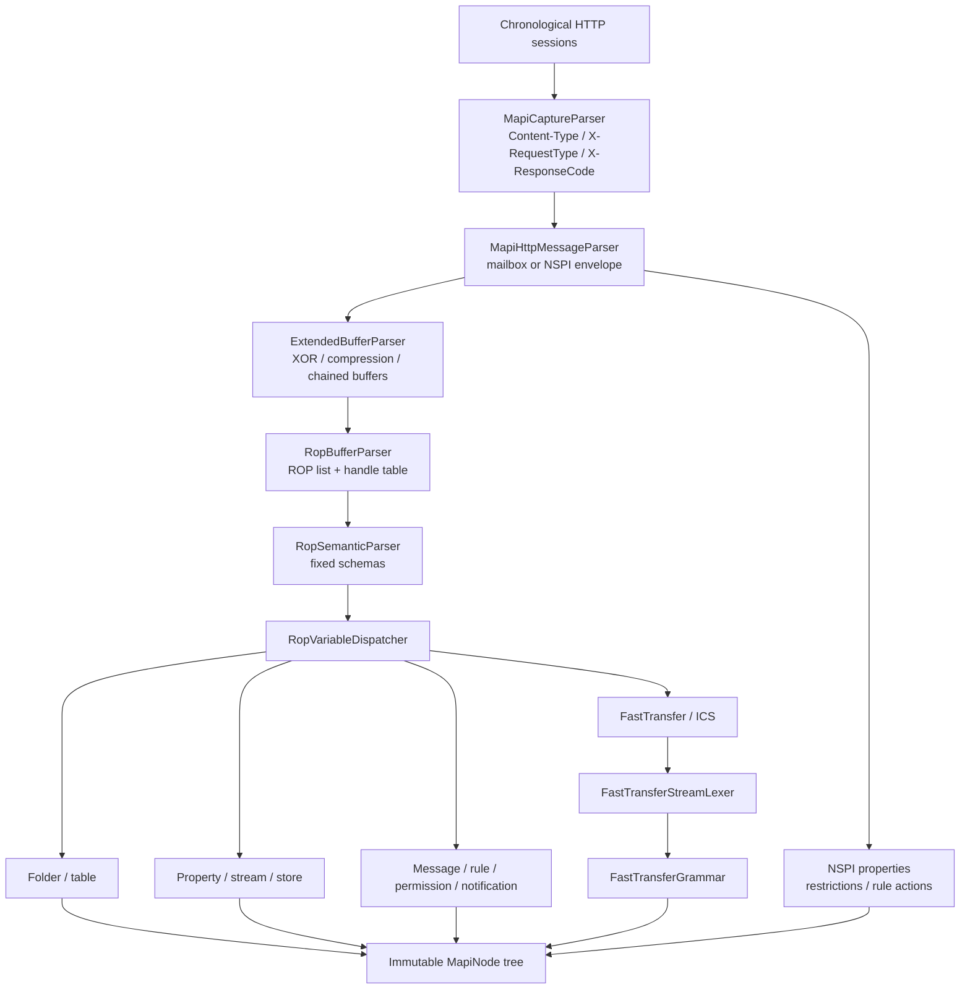
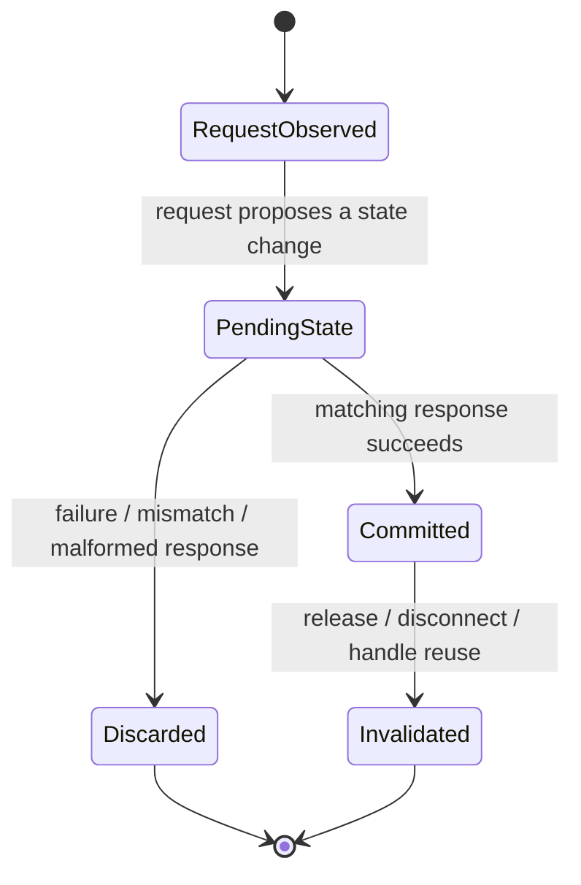

# MAPI parsing architecture

MAPI parsing is a second, capture-aware pass over already normalized HTTP bodies. It never changes ordinary HTTP parsing and never receives only the 64 KiB display preview.

## Pipeline

## Capture-local context

`MapiCaptureContext` exists once per `MapiCaptureParser.Parse` call. It correlates facts that the wire protocol splits across operations or HTTP round trips:

- logical MAPI connections from cookies and bounded fallback identity;
- logon privacy and logon/handle aliases;
- server-object handle tables and object provenance;
- table columns and property-tag shapes;
- request ROP checkpoints used by response parsing;
- FastTransfer upload/download stream state;
- ICS UploadStateStream Begin/Continue/End state.

The context is deliberately not static. A new capture cannot inherit handles, cookies, FastTransfer fragments, or table shapes from a previous capture.

This pattern prevents failed requests from poisoning later parses. When the protocol does not provide enough identity to correlate safely, the parser retains raw data and a warning instead of guessing.

## ROP parsing

`RopBufferParser` first separates the ROP list from the trailing 32-bit handle table. It pre-registers valid handle-table values in the capture context, then asks `RopSemanticParser` to walk operations in order.

`RopSemanticParser` handles common framing and fixed schemas. Variable operations are routed by `RopVariableDispatcher` to protocol-family decoders. Every node carries:

- semantic name and `MapiNodeKind`;
- absolute byte offset and length;
- optional rendered value;
- immutable child nodes.

Unknown or malformed operations stop at a defensible boundary. The untouched remainder becomes a bounded `Raw` node, preserving evidence without speculative resynchronization.

## FastTransfer and ICS

FastTransfer buffers can split a value across ROPs and HTTP sessions. `FastTransferStreamAssembler` keys state by logical connection and server object handle, not by the temporary handle-table index alone.

`FastTransferStreamLexer` is responsible for byte boundaries: markers, property tags, fixed/variable/multi-valued properties, continuation state, limits, and forward progress. `FastTransferGrammar` consumes only completed lexical elements and validates higher-level productions such as:

- contents and hierarchy synchronization;
- state and message-list streams;
- top-folder, folder, message, recipient, and attachment content;
- deletion/read-state phases and RecoverMode error information.

The lexer never scans ahead for a plausible marker after an error. Grammar state advances only after a valid element and is adopted transactionally with the lexical result.

## Safety budgets

The main limits are centralized in `MapiParseLimits`, `MapiNodeBudget`, and `FastTransferLimits`. They bound payload bytes, node count, tree depth, collections, strings, retained raw bytes, stream elements, and state entries. Cancellation flows through the readers and long loops.

When adding a parser:

1. read only through `MapiReader`;
2. claim every output node through the shared budget;
3. retain offsets relative to the original capture;
4. mutate `MapiCaptureContext` only through a request/response transaction;
5. prefer a bounded raw node plus warning over inferred structure.

