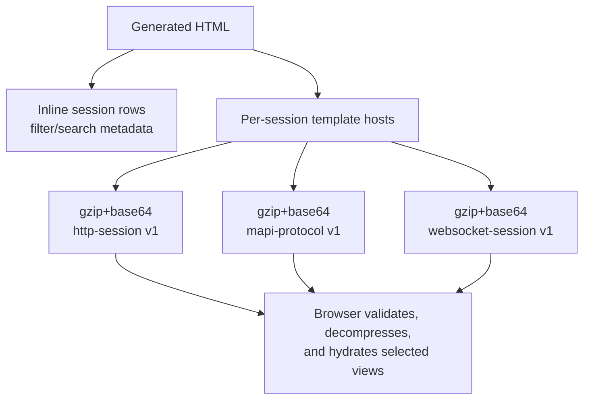
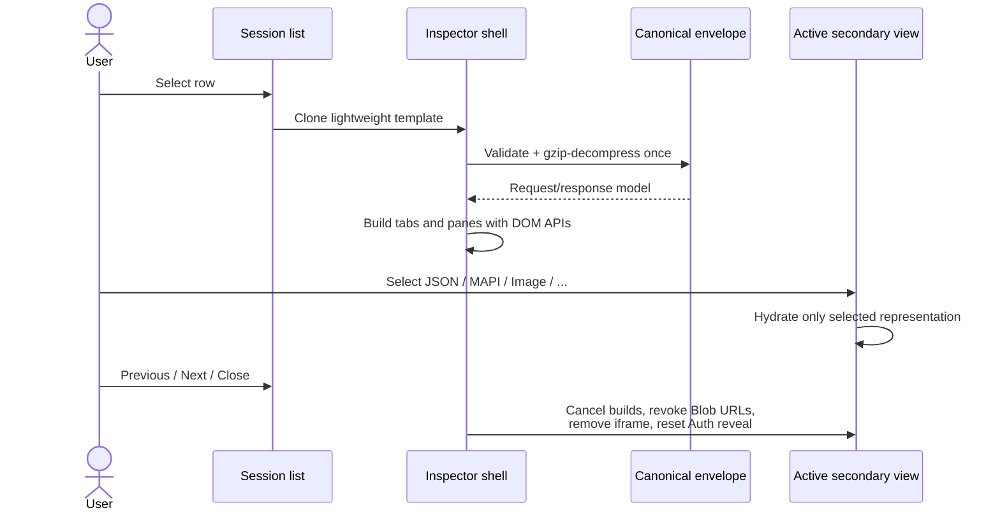
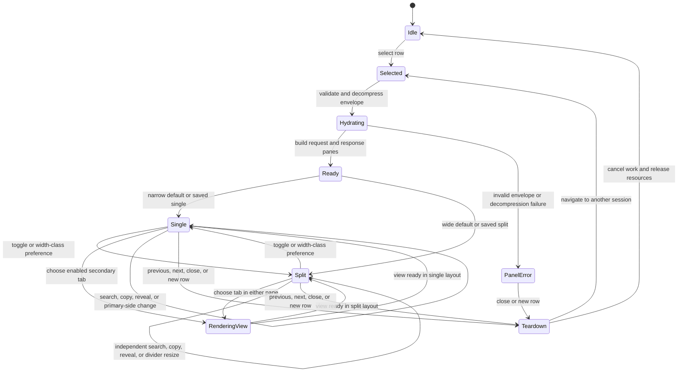

# Generated report runtime

The output is one HTML file. It contains no external scripts, styles, fonts, images, or data dependencies.

## Generator structure

`HtmlReportGenerator` is one partial class split by responsibility:

- `HtmlReportGenerator.cs` owns the outer document, CSS, browser JavaScript, list controls, inspector lifecycle, search, tabs, trees, themes, and popup mode.
- `HtmlReportGenerator.Payloads.cs` emits list rows/templates and builds compressed HTTP, MAPI, and WebSocket payload envelopes.

The split is source organization only; generated output remains deterministic.

## Data layout

An HTTP envelope contains ordered headers, start lines, format/detection metadata, retained captured bytes, and decoded bytes only when they differ. It does not store pre-rendered Headers, Raw, hex, JSON/XML trees, Auth text, WebView markup, or copy models. MAPI trees stay server-parsed because they depend on the C# protocol stack. WebSocket payloads stay independently compressed by session.

Before using an envelope, browser code checks its type, version, base64 form, declared decoded length, decompression limit, UTF-8/JSON validity, and model shape. A corrupt envelope produces an announced panel error rather than a blank inspector.

## HTTP inspector lifecycle

Single view shows Request or Response tabs. The compact layout icon beside Previous/Next switches to split view; while both panes are visible, the redundant primary tabs are hidden and each pane has a visible heading. Each side owns independent secondary tabs, active-view search, copy status, and lazy state. At 900 pixels and wider the default is split with a pointer- and keyboard-resizable divider. Narrow layouts default to single; a remembered narrow split choice stacks the panes and disables the divider. Wide and narrow preferences are stored independently, and crossing the breakpoint applies the corresponding remembered choice or default.

Dynamic resources are tied to the current render generation. Navigation invalidates stale asynchronous work. Image Blob URLs are revoked, WebView iframes are removed, interrupted tree batches stop, and Auth reveal state is discarded.

`Selected` identifies the session but does not imply any expensive view exists. `Hydrating` runs once per selected session; both split panes share that validated model without double decompression. `RenderingView` represents generation-bound asynchronous tree, image, or WebView work. Any transition through `Teardown` invalidates its generation before releasing resources, so late work cannot update the next session.

## Secondary views

| View | Source |
|---|---|
| JSON/XML | Decoded text; client parser/formatter and bounded tree |
| MAPI | Precomputed compressed `MapiNode` model |
| Image | Complete validated retained raster bytes in a short-lived Blob URL |
| WebView | Complete retained HTML passed through the defensive tokenizer |
| HexView | Exact retained captured bytes, optionally distinct decoded bytes |
| Auth | Ordered auth headers; redacted until explicit per-view reveal |
| Headers | Start line and ordered captured headers |
| Raw | Captured headers plus decoded/body representation and byte provenance |

Copy text and active-search text are built from the active model on demand. Search never indexes unrevealed Auth values. JSON and XML expose Tree and Formatted Text subviews; JSON/XML/MAPI trees render in animation-frame batches with node/depth/child budgets.

## Browser state

Three non-sensitive preferences use safely wrapped `localStorage`:

- `saz-viewer-theme`: explicit `light` or `dark`;
- `saz-viewer.http-layout.wide.v2`: wide `single` or `split`;
- `saz-viewer.http-layout.narrow.v2`: narrow `single` or `split`.

On first load after the layout-storage change, legacy `saz-viewer.http-layout.v1=split` is migrated to the wide key. Legacy `single` is removed without migration so the new wide split default applies. Storage failure keeps an in-page toggle usable but returns to the width-class default on reload.

No capture identity, URL, header, body, search query, Auth reveal state, or navigation position is persisted. Storage failure degrades to current-tab behavior.
