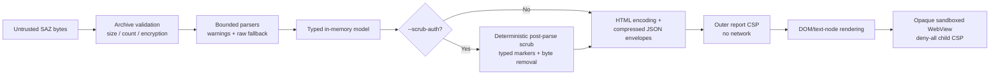

# Security model

SAZ files and every value inside them are untrusted input. The tool has two trust boundaries: archive parsing in .NET and report rendering in the browser. The desktop app renders the same parsed model in native WPF views and keeps a WebView2 sandbox only for the WebView tab.

## Archive and password boundary

- ZIP entries are validated for count, lengths, compression ratio, method, encryption vendor/version, and duplicate/path behavior before parsing.
- Unencrypted archives use the .NET ZIP reader. Supported encrypted entries use SharpZipLib behind `ISazArchive`.
- WinZip AES AE-2 data is accepted only after authentication. ZipCrypto is CRC-checked but is documented as legacy unauthenticated encryption.
- Decrypted entry data is cached only in memory and returned only after the complete entry passes integrity checks.
- Passwords enter through `ISazPasswordProvider`. Interactive input is not echoed; `--password-stdin` reads one bounded line. Mutable character buffers are cleared promptly, while the unavoidable managed `string` limitation is documented.
- Wrong password, unsupported encryption, corruption, archive limits, path errors, and I/O failures have separate exceptions and CLI messages.

## Parser boundary

Each layer enforces limits independently. Important examples include archive bytes, encrypted entry bytes, HTTP read/decode expansion, metadata XML, WebSocket records/payloads, MAPI payloads/nodes/depth, report-envelope decoded size, browser search matches, and copy text.

XML readers prohibit DTDs and external resolution. Decompression is bounded and transactional. Unknown protocol shapes are represented as bounded raw bytes rather than interpreted speculatively.

### Limits and budgets

These are the principal hard limits enforced by the current implementation. A smaller context-dependent limit may apply in addition.

| Boundary | Limit | Source |
|---|---:|---|
| ZIP entries | 100,000 | `SazArchiveFactory.MaxEntries` |
| Encrypted entry / encrypted total | 256 MiB / 1 GiB | `SazArchiveFactory` |
| Buffered non-seekable archive | 512 MiB | `SazArchiveFactory` |
| Encrypted compression ratio | 1,000:1 | `SazArchiveFactory` |
| Password | 1,024 characters; at most 3 interactive attempts | `SazPasswordLimits`, `SazArchiveFactory` |
| Metadata XML | 1 MiB | `SazParser.MaxMetadataBytes` |
| HTTP entry read window | 4 MiB + 128 KiB | `HttpMessageParser.MaxEntryRead` |
| HTTP decoded body | 4 MiB and at most 100× encoded size, with a 1 MiB floor | `HttpBodyDecoder.OutputLimit` |
| HTTP coding chain / gzip members | 8 / 128 | `HttpBodyDecoder` |
| Body display / captured-byte retention / HexView | 64 KiB / 16 KiB / 1 KiB | HTTP parser/decoder and report generator |
| Formatted JSON/XML/text | 256 KiB, depth 64, at most 8× source | `BodyFormatter` |
| WebSocket entry / records | 256 MiB / 10,000 | `WebSocketParser` |
| Retained WebSocket payload per entry / logical message | 16 MiB / 1 MiB | parser and assembler |
| MAPI payload / nodes / depth | 4 MiB / 25,000 / 64 | `MapiParseLimits` |
| MAPI collection / string / raw fallback | 100,000 / 1 MiB / 16 KiB | `MapiParseLimits` |
| FastTransfer elements / nesting / tracked streams | 20,000 / 64 / 4,096 | `FastTransferLimits` |
| HTTP, protocol, or WebSocket decoded envelope | 32 MiB each | `HtmlReportGenerator` |
| MAPI tree decoded envelope | 8 MiB | `HtmlReportGenerator.TreePayloadMaxDecodedBytes` |
| Browser tree | 4,000 nodes, depth 40, 300 children per node | `HtmlReportGenerator` |
| Hydrated text / copy text | 256 KiB / 1 MiB | `HtmlReportGenerator` |
| WebSocket messages embedded per session | 5,000 within a 28 MiB content budget | `HtmlReportGenerator` |

## Outer report

The report's CSP blocks all default loads, connections, workers, objects, forms, media, and fonts. Inline CSS/JavaScript is allowed because the application itself is embedded in the single file; captured values never become executable JavaScript or CSS.

Captured strings enter the outer DOM through HTML encoding during generation or through `textContent`/text nodes at runtime. Binary data is formatted as text. Image rendering accepts only structurally validated PNG, JPEG, GIF, WebP, BMP, and ICO bytes; SVG is never eligible. Images use local Blob URLs and are revoked during teardown.

## WebView

WebView is not a normal browser preview. It is a deliberately reduced structural rendering:

1. only complete retained HTML/XHTML-like text is eligible;
2. a conservative tokenizer keeps a small inert element allowlist;
3. all captured attributes are removed;
4. scripts, styles, metadata, forms, SVG/MathML, frames, media, and resource elements are removed;
5. the resulting document receives a deny-all child CSP;
6. the iframe has an empty `sandbox` permission list, so it has an opaque origin and no scripts, forms, popups, navigation, storage, or parent access.

Captured HTML is never inserted into the parent report DOM. Active search switches WebView to the source-text representation rather than weakening the sandbox.

## Authentication headers

The Auth view recognizes only `Authorization`, `Proxy-Authorization`, `WWW-Authenticate`, and `Proxy-Authenticate`. It starts redacted and conservatively masks credentials, tokens, nonces, responses, and unknown schemes. Full values are read from the already bounded canonical model only after explicit Reveal.

Reveal state is scoped to one side/session/view and resets on tab change, navigation, close, or teardown. Before reveal, full values do not appear in Auth DOM text, attributes, accessible names, titles, search results, or copied Auth text. Full captured values remain visible in Headers and Raw by product design.

## Export scrubbing

`--scrub-auth` is an explicit export transformation, separate from the Auth tab's interactive masking. The parser first uses the original bounded values so JSON, XML, HTTP decoding, WebSocket assembly, and MAPI semantics remain intact. `AuthScrubber` then rewrites the in-memory report before any outer HTML or compressed payload envelope is generated.

The scrub pass covers request/response start lines and headers, every cookie value, sensitive URL parameters, JSON/form/XML/multipart/plain-text bodies, decodable WebSocket payloads, MAPI names/values/warnings, metadata, timers, and warnings. It recognizes authentication schemes and challenges, common API/subscription/function/CSRF headers, Azure SAS and shared-key forms, OAuth fields, JWT/JWE, GitHub/Slack/AWS/Google tokens, private keys, SAML assertions, and common webhook URLs. Replacements preserve surrounding structure where practical and use deterministic typed markers. A report banner and CLI summary contain marker counts only; secret values are never logged by the scrubber.

Opaque data is fail-closed. If a retained HTTP or WebSocket payload cannot be decoded and safely rewritten, its bytes are dropped and the model receives an explicit `removed by --scrub-auth` note. Malformed declared JSON/XML/multipart bodies, binary WebSocket messages, and raw MAPI byte nodes are removed rather than interpreted heuristically; URL user-info is redacted. When decoded HTTP content is scrubbed, pre-decode compressed/transfer-encoded bytes are also removed so HexView, Image, WebView, Raw, search, and copy cannot recover the original. The unflagged path never invokes the scrubber and does not emit scrub metadata or UI.

Scrubbing intentionally favors over-redaction and is defense in depth rather than a data-classification guarantee. Tests seed canaries across synthetic SAZ locations, inspect the resulting model and outer HTML, decompress every embedded gzip envelope, decode retained byte fields, and exercise representative inspector views in Edge.

## Desktop host

`SazViewer.App` shows captured data in native WPF controls. Captured values are only ever assigned to text properties (`TextBlock`/`Run` text, list items), never parsed as XAML or markup, so they cannot become UI or code. The views reuse the report's bounds: the 64 KiB display body limit, the tree and MAPI node budgets, the 1,024-byte HexView prefix, the 5,000-match search cap and the copy caps.

- **Images.** `ImageSafety` accepts only complete retained bodies whose signature and structure validate as PNG, JPEG, GIF, WebP, BMP or ICO, never SVG. It checks dimensions before decoding, decodes off the UI thread with a pixel limit into a frozen bitmap, and releases it when the tab is left.
- **Auth.** Values start redacted. Reveal applies to one view, and every tab, side, session, layout or window transition redacts again. Copy returns full values only while revealed. Reveal state is never persisted.
- **WebView tab.** This is the only place HTML is rendered: the inert document from `SafeHtmlPreviewBuilder` (no captured attributes, scripts, styles, forms, frames or resources) inside a WebView2 governed by `WebPreviewPolicy`:
  - scripts, host objects, web messages, context menus, accelerators, autofill and error pages are off, and DevTools exist only in Debug builds;
  - the document is served once from memory at `https://webview-preview.sazviewer.invalid/document.html`, and every other request receives `403` before reaching the network or file system;
  - only that initial navigation is allowed, and any other navigation closes the preview; frame navigation, new windows, downloads, permissions, authentication prompts and external protocols are refused.

  The control is created only while the tab is shown in Rendered mode and disposed on every transition.
- **Scrubbed viewing.** **View scrubbed** re-parses through the same `AuthScrubber` pass as `--scrub-auth`, so the native views, search and copy see only the scrubbed model.
- **Tabs and windows.** Each tab owns its document and view-models. Pop-out inspector windows belong to their tab and close when it closes, its capture is reloaded, or the app exits. Dropped `.saz` files open as new tabs.- **Single instance.** A second launch forwards only file paths. The `Local\` mutex and pipe names are scoped to the user SID, session ID and a hash of the data directory. The pipe is created with `FirstPipeInstance` (so another process cannot pre-create the name and receive the paths) and an ACL that allows only the current user and denies `NETWORK` logons. The client connects with `PipeOptions.CurrentUserOnly`, so it also verifies the server's owner. The protocol (`SAZV`, version byte, length, JSON `{"paths":[…]}`) has no field for passwords or options. The server rejects bad headers, wrong versions, payloads over 256 KiB, unknown or duplicate properties, non-string entries, more than 32 paths, paths over 2,048 characters, and trailing data. Of a well-formed request, it opens only existing, fully qualified, normalized `.saz` paths and refuses device paths, alternate data streams and wildcards. Each exchange is bounded by connect and read timeouts, so a stalled client cannot block the server for long.
- **File association.** Registration writes only under `HKCU\Software\Classes` (no elevation) and never changes `.saz`'s default value or `UserChoice`. It adds the `SazViewer.Capture` ProgID (marked with an owner value), an `OpenWithProgids` value, and `Applications\SazViewer.App.exe` with `SupportedTypes`. The command is `"<full exe path>" "%1"`, so a capture path can only become a single quoted argument. Unregister deletes only keys and values carrying the owner marker, plus `.saz` keys that the app itself created. Pre-existing handlers such as Fiddler's `SAZ File` are kept.
- **File watching.** The watcher reads only file metadata (length and last-write time). A reload re-runs the normal, bounded parse pipeline only after a user click and asks for an encrypted capture's password again. Passwords are not cached between loads.
- **State.** `preferences.json` holds only the theme, layout and banner choices; `recent.json` stores fully qualified paths only; WebView2 data for the WebView tab lives in `%LOCALAPPDATA%\SazViewer\WebView2`. No captured data is persisted.
- **Passwords.** The modal dialog reads `PasswordBox.SecurePassword` into a mutable `char[]` (zeroing the unmanaged copy), clears the box, and returns the buffer to the archive layer, which clears it after use. Passwords are never arguments, settings, or log entries.

## Review checklist

For any feature that renders capture data, verify:

- no new network-capable CSP source or iframe sandbox permission;
- no captured string reaches `innerHTML`, script, style, navigation/resource URL, or event-handler context (validated image bytes may use a local Blob URL);
- all byte/text work has an explicit cap and failure UI;
- lazy work is cancelled on navigation and resources are released;
- secrets are not persisted, logged, or placed in hidden/accessibility-only DOM;
- malformed input produces a warning/error, not a success-shaped fallback.
