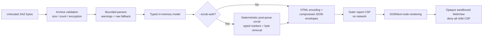

# Security model

SAZ files and every value inside them are untrusted input. The tool has two trust boundaries: archive parsing in .NET and report rendering in the browser. The desktop app adds a WebView2 host boundary around the same report.

## Archive and password boundary

- ZIP entries are validated for count, lengths, compression ratio, method, encryption vendor/version, and duplicate/path behavior before parsing.
- Unencrypted archives use the .NET ZIP reader. Supported encrypted entries use SharpZipLib behind `ISazArchive`.
- WinZip AES AE-2 data is accepted only after authentication. ZipCrypto is CRC-checked but is documented as legacy unauthenticated encryption.
- Decrypted entry data is cached only in memory and returned only after the complete entry passes integrity checks.
- Passwords enter through `ISazPasswordProvider`. Interactive input is not echoed; `--password-stdin` reads one bounded line. Mutable character buffers are cleared promptly, while the unavoidable managed `string` limitation is documented.
- Wrong password, unsupported encryption, corruption, archive limits, path errors, and I/O failures have separate exceptions and CLI messages.

## Parser boundary

Each layer enforces limits independently. Important examples include archive bytes, encrypted entry bytes, HTTP read/decode expansion, metadata XML, WebSocket records/payloads, MAPI payloads/nodes/depth, report-envelope decoded size, browser search matches, and copy text.

XML readers prohibit DTDs and external resolution. Decompression is bounded and transactional. Unknown protocol shapes are represented as bounded raw bytes rather than interpreted speculatively.

### Limits and budgets

These are the principal hard limits enforced by the current implementation. A smaller context-dependent limit may apply in addition.

| Boundary | Limit | Source |
|---|---:|---|
| ZIP entries | 100,000 | `SazArchiveFactory.MaxEntries` |
| Encrypted entry / encrypted total | 256 MiB / 1 GiB | `SazArchiveFactory` |
| Buffered non-seekable archive | 512 MiB | `SazArchiveFactory` |
| Encrypted compression ratio | 1,000:1 | `SazArchiveFactory` |
| Password | 1,024 characters; at most 3 interactive attempts | `SazPasswordLimits`, `SazArchiveFactory` |
| Metadata XML | 1 MiB | `SazParser.MaxMetadataBytes` |
| HTTP entry read window | 4 MiB + 128 KiB | `HttpMessageParser.MaxEntryRead` |
| HTTP decoded body | 4 MiB and at most 100× encoded size, with a 1 MiB floor | `HttpBodyDecoder.OutputLimit` |
| HTTP coding chain / gzip members | 8 / 128 | `HttpBodyDecoder` |
| Body display / captured-byte retention / HexView | 64 KiB / 16 KiB / 1 KiB | HTTP parser/decoder and report generator |
| Formatted JSON/XML/text | 256 KiB, depth 64, at most 8× source | `BodyFormatter` |
| WebSocket entry / records | 256 MiB / 10,000 | `WebSocketParser` |
| Retained WebSocket payload per entry / logical message | 16 MiB / 1 MiB | parser and assembler |
| MAPI payload / nodes / depth | 4 MiB / 25,000 / 64 | `MapiParseLimits` |
| MAPI collection / string / raw fallback | 100,000 / 1 MiB / 16 KiB | `MapiParseLimits` |
| FastTransfer elements / nesting / tracked streams | 20,000 / 64 / 4,096 | `FastTransferLimits` |
| HTTP, protocol, or WebSocket decoded envelope | 32 MiB each | `HtmlReportGenerator` |
| MAPI tree decoded envelope | 8 MiB | `HtmlReportGenerator.TreePayloadMaxDecodedBytes` |
| Browser tree | 4,000 nodes, depth 40, 300 children per node | `HtmlReportGenerator` |
| Hydrated text / copy text | 256 KiB / 1 MiB | `HtmlReportGenerator` |
| WebSocket messages embedded per session | 5,000 within a 28 MiB content budget | `HtmlReportGenerator` |

## Outer report

The report's CSP blocks all default loads, connections, workers, objects, forms, media, and fonts. Inline CSS/JavaScript is allowed because the application itself is embedded in the single file; captured values never become executable JavaScript or CSS.

Captured strings enter the outer DOM through HTML encoding during generation or through `textContent`/text nodes at runtime. Binary data is formatted as text. Image rendering accepts only structurally validated PNG, JPEG, GIF, WebP, BMP, and ICO bytes; SVG is never eligible. Images use local Blob URLs and are revoked during teardown.

## WebView

WebView is not a normal browser preview. It is a deliberately reduced structural rendering:

1. only complete retained HTML/XHTML-like text is eligible;
2. a conservative tokenizer keeps a small inert element allowlist;
3. all captured attributes are removed;
4. scripts, styles, metadata, forms, SVG/MathML, frames, media, and resource elements are removed;
5. the resulting document receives a deny-all child CSP;
6. the iframe has an empty `sandbox` permission list, so it has an opaque origin and no scripts, forms, popups, navigation, storage, or parent access.

Captured HTML is never inserted into the parent report DOM. Active search switches WebView to the source-text representation rather than weakening the sandbox.

## Authentication headers

The Auth view recognizes only `Authorization`, `Proxy-Authorization`, `WWW-Authenticate`, and `Proxy-Authenticate`. It starts redacted and conservatively masks credentials, tokens, nonces, responses, and unknown schemes. Full values are read from the already bounded canonical model only after explicit Reveal.

Reveal state is scoped to one side/session/view and resets on tab change, navigation, close, or teardown. Before reveal, full values do not appear in Auth DOM text, attributes, accessible names, titles, search results, or copied Auth text. Full captured values remain visible in Headers and Raw by product design.

## Export scrubbing

`--scrub-auth` is an explicit export transformation, separate from the Auth tab's interactive masking. The parser first uses the original bounded values so JSON, XML, HTTP decoding, WebSocket assembly, and MAPI semantics remain intact. `AuthScrubber` then rewrites the in-memory report before any outer HTML or compressed payload envelope is generated.

The scrub pass covers request/response start lines and headers, every cookie value, sensitive URL parameters, JSON/form/XML/multipart/plain-text bodies, decodable WebSocket payloads, MAPI names/values/warnings, metadata, timers, and warnings. It recognizes authentication schemes and challenges, common API/subscription/function/CSRF headers, Azure SAS and shared-key forms, OAuth fields, JWT/JWE, GitHub/Slack/AWS/Google tokens, private keys, SAML assertions, and common webhook URLs. Replacements preserve surrounding structure where practical and use deterministic typed markers. A report banner and CLI summary contain marker counts only; secret values are never logged by the scrubber.

Opaque data is fail-closed. If a retained HTTP or WebSocket payload cannot be decoded and safely rewritten, its bytes are dropped and the model receives an explicit `removed by --scrub-auth` note. Malformed declared JSON/XML/multipart bodies, binary WebSocket messages, and raw MAPI byte nodes are removed rather than interpreted heuristically; URL user-info is redacted. When decoded HTTP content is scrubbed, pre-decode compressed/transfer-encoded bytes are also removed so HexView, Image, WebView, Raw, search, and copy cannot recover the original. The unflagged path never invokes the scrubber and does not emit scrub metadata or UI.

Scrubbing intentionally favors over-redaction and is defense in depth rather than a data-classification guarantee. Tests seed canaries across synthetic SAZ locations, inspect the resulting model and outer HTML, decompress every embedded gzip envelope, decode retained byte fields, and exercise representative inspector views in Edge.

## Desktop host (WebView2)

`SazViewer.App` adds a third boundary: the WebView2 host around the unchanged report. `SecureReportSession` applies the same policy to the main window and every inspector popup.

- **Content source.** The report is served from memory through `WebResourceRequested` only for `https://saz-viewer.invalid/report.html` (exact scheme, host, path, and default port; no query or user-info). The reserved `.invalid` TLD cannot resolve. Responses carry `Cache-Control: no-store`, `X-Content-Type-Options: nosniff`, and `Referrer-Policy: no-referrer`. The report's CSP is untouched. No report or temp file is written to disk unless the user exports.
- **Requests.** The filter covers every URI, resource context, and request source kind; every other request receives `403` before reaching the network or file system.
- **Navigation.** Top-level navigation is cancelled unless it targets the report document (fragments allowed). Subframes may load only `about:srcdoc` and `about:blank`, so the WebView tab's empty-permission sandbox iframe keeps working without exceptions. User-dropped `file:` `.saz` navigations are converted into an app open request; external protocol launches are cancelled.
- **Windows.** `NewWindowRequested` is handled for every request. Only the report URL from a current document gets a new `ReportPopupWindow` with an identically configured session; everything else makes `window.open` return `null`. Popups close when the capture changes or the app exits.
- **Other surfaces.** Downloads are cancelled (Export is a WPF save dialog), permission requests are denied, HTTP auth prompts are cancelled, host objects and web messages are disabled, DevTools and browser accelerators are Debug-only, and the context menu is reduced to edit commands.
- **State.** WebView2 data, including the report's theme/layout/scrub-banner `localStorage`, lives in the per-user `%LOCALAPPDATA%\SazViewer\WebView2` folder. `recent.json` stores fully qualified paths only.
- **Passwords.** The modal dialog reads `PasswordBox.SecurePassword` into a mutable `char[]` (zeroing the unmanaged copy), clears the box, and returns the buffer to the archive layer, which clears it after use. Passwords are never arguments, settings, or log entries.

## Review checklist

For any feature that renders capture data, verify:

- no new network-capable CSP source or iframe sandbox permission;
- no captured string reaches `innerHTML`, script, style, navigation/resource URL, or event-handler context (validated image bytes may use a local Blob URL);
- all byte/text work has an explicit cap and failure UI;
- lazy work is cancelled on navigation and resources are released;
- secrets are not persisted, logged, or placed in hidden/accessibility-only DOM;
- malformed input produces a warning/error, not a success-shaped fallback.
