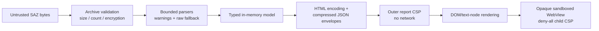

# Security model

SAZ files and every value inside them are untrusted input. The tool has two trust boundaries: archive parsing in .NET and report rendering in the browser.

## Archive and password boundary

- ZIP entries are validated for count, lengths, compression ratio, method, encryption vendor/version, and duplicate/path behavior before parsing.
- Unencrypted archives use the .NET ZIP reader. Supported encrypted entries use SharpZipLib behind `ISazArchive`.
- WinZip AES AE-2 data is accepted only after authentication. ZipCrypto is CRC-checked but is documented as legacy unauthenticated encryption.
- Decrypted entry data is cached only in memory and returned only after the complete entry passes integrity checks.
- Passwords enter through `ISazPasswordProvider`. Interactive input is not echoed; `--password-stdin` reads one bounded line. Mutable character buffers are cleared promptly, while the unavoidable managed `string` limitation is documented.
- Wrong password, unsupported encryption, corruption, archive limits, path errors, and I/O failures have separate exceptions and CLI messages.

## Parser boundary

Each layer enforces limits independently. Important examples include archive bytes, encrypted entry bytes, HTTP read/decode expansion, metadata XML, WebSocket records/payloads, MAPI payloads/nodes/depth, report-envelope decoded size, browser search matches, and copy text.

XML readers prohibit DTDs and external resolution. Decompression is bounded and transactional. Unknown protocol shapes are represented as bounded raw bytes rather than interpreted speculatively.

## Outer report

The report's CSP blocks all default loads, connections, workers, objects, forms, media, and fonts. Inline CSS/JavaScript is allowed because the application itself is embedded in the single file; captured values never become executable JavaScript or CSS.

Captured strings enter the outer DOM through HTML encoding during generation or through `textContent`/text nodes at runtime. Binary data is formatted as text. Image rendering accepts only structurally validated PNG, JPEG, GIF, WebP, BMP, and ICO bytes; SVG is never eligible. Images use local Blob URLs and are revoked during teardown.

## WebView

WebView is not a normal browser preview. It is a deliberately reduced structural rendering:

1. only complete retained HTML/XHTML-like text is eligible;
2. a conservative tokenizer keeps a small inert element allowlist;
3. all captured attributes are removed;
4. scripts, styles, metadata, forms, SVG/MathML, frames, media, and resource elements are removed;
5. the resulting document receives a deny-all child CSP;
6. the iframe has an empty `sandbox` permission list, so it has an opaque origin and no scripts, forms, popups, navigation, storage, or parent access.

Captured HTML is never inserted into the parent report DOM. Active search switches WebView to the source-text representation rather than weakening the sandbox.

## Authentication headers

The Auth view recognizes only `Authorization`, `Proxy-Authorization`, `WWW-Authenticate`, and `Proxy-Authenticate`. It starts redacted and conservatively masks credentials, tokens, nonces, responses, and unknown schemes. Full values are read from the already bounded canonical model only after explicit Reveal.

Reveal state is scoped to one side/session/view and resets on tab change, navigation, close, or teardown. Before reveal, full values do not appear in Auth DOM text, attributes, accessible names, titles, search results, or copied Auth text. Full captured values remain visible in Headers and Raw by product design.

## Review checklist

For any feature that renders capture data, verify:

- no new network-capable CSP source or iframe sandbox permission;
- no captured string reaches `innerHTML`, script, style, navigation/resource URL, or event-handler context (validated image bytes may use a local Blob URL);
- all byte/text work has an explicit cap and failure UI;
- lazy work is cancelled on navigation and resources are released;
- secrets are not persisted, logged, or placed in hidden/accessibility-only DOM;
- malformed input produces a warning/error, not a success-shaped fallback.
